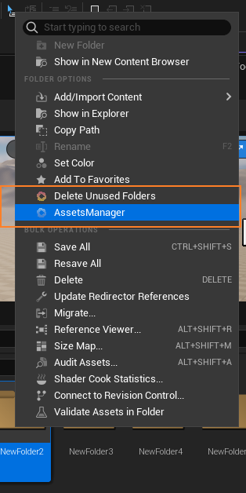

# Assets Manager


当前版本`v1.1.5`

Assets Manager是基于`Unreal C++`书写的一款资产管理软件，以项目插件的方式应用到项目中

目前包含资产筛查、资产规范自定义检测等功能，集成了资产修改、删除、查找引用等操作，便于用户在一个界面内实现批量资产管理和修改，尤其对于大型项目来说，可以极大提升项目资产管理的效率


## 环境依赖
Assets Manager依赖虚幻的官方库实现，目前依赖的库包括

这些库被定义在[AssetsManager.Build.cs](https://github.com/CaptainRex0428/AssetsManager/blob/master/Source/AssetsManager/AssetsManager.Build.cs)文件中

```C#
PublicDependencyModuleNames.AddRange
(
	new string[]
	{
		"Core",
    "Blutility",
		"EditorScriptingUtilities",
		"UMG",
		"Niagara",
    "UnrealEd",
    "AssetRegistry",
    "AssetTools",
    "ContentBrowser",
		"InputCore",
		"Projects"
		
	}
);
	

PrivateDependencyModuleNames.AddRange
(
	new string[]
	{
		"CoreUObject",
		"Engine",
		"Slate",
		"SlateCore"
		
	}
);

```

&nbsp;

## 使用说明

### 安装说明

#### Release版本
1. 下载对应版本的[Release](https://github.com/CaptainRex0428/AssetsManager/releases)
2. 将解压文件放入引擎项目的`Plugins文件夹`中（没有的话自行创建）。参考地址`{%ProjectFolder}/Plugins/AssetsManager`
3. 打开引擎即可


#### 源码版本
1. Clone源码到引擎项目的`Plugins文件夹`中（没有的话自行创建）。参考地址`{%ProjectFolder}/Plugins/AssetsManager`
2. 右键uproject文件生成新的`.sln文件`
3. 打开`.sln文件`编译
4. 编译成功后即可运行


### 使用说明
在待检查资产的文件夹上右键，选择`AssetsManager`即可打开插件主界面


&nbsp;

#### 界面说明

1. 基础信息界面
2. 资产类型筛选
3. 错误条件筛选
4. 筛选后资产列表
5. 批量处理模块


##目录结构描述
|— [AssetsManager.uplugin](https://github.com/CaptainRex0428/AssetsManager/blob/master/AssetsManager.uplugin)

|— [.gitignore](https://github.com/CaptainRex0428/AssetsManager/blob/master/.gitignore)

|— [ReadMe.md](https://github.com/CaptainRex0428/AssetsManager/blob/master/ReadMe.md)

|— [Resources](https://github.com/CaptainRex0428/AssetsManager/tree/master/Resources)

——|— [Icon128.png](https://github.com/CaptainRex0428/AssetsManager/blob/master/Resources/Icon128.png)

——|— [LOGO.ai](https://github.com/CaptainRex0428/AssetsManager/blob/master/Resources/LOGO.ai)

——|—— [LOGO_GREY_256.png](https://github.com/CaptainRex0428/AssetsManager/blob/master/Resources/LOGO_GREY_256.png)

——|—— [LOGO_ORANGE_256.png](https://github.com/CaptainRex0428/AssetsManager/blob/master/Resources/LOGO_ORANGE_256.png)

——|—— [LOGO_PURPLE_256.png](https://github.com/CaptainRex0428/AssetsManager/blob/master/Resources/LOGO_PURPLE_256.png)

——|—— [LOGO_RED_256.png](https://github.com/CaptainRex0428/AssetsManager/blob/master/Resources/LOGO_RED_256.png)

|—— [Source](https://github.com/CaptainRex0428/AssetsManager/tree/master/Source)

——|—— [AssetsManager](https://github.com/CaptainRex0428/AssetsManager/tree/master/Source/AssetsManager)

————|—— [AssetsManager.Build.cs](https://github.com/CaptainRex0428/AssetsManager/blob/master/Source/AssetsManager/AssetsManager.Build.cs)

————|—— [Public](https://github.com/CaptainRex0428/AssetsManager/tree/master/Source/AssetsManager/Public)

——————|—— [AssetsManager.h](https://github.com/CaptainRex0428/AssetsManager/blob/master/Source/AssetsManager/Public/AssetsManager.h)

——————|—— [AssetsManagerConfig.h](https://github.com/CaptainRex0428/AssetsManager/blob/master/Source/AssetsManager/Public/AssetsManagerConfig.h)

——————|—— [AssetsManagerStyle.h](https://github.com/CaptainRex0428/AssetsManager/blob/master/Source/AssetsManager/Public/AssetsManagerStyle.h)

——————|—— [ManagerLogger.h](https://github.com/CaptainRex0428/AssetsManager/blob/master/Source/AssetsManager/Public/ManagerLogger.h)

——————|—— [StandardAsset](https://github.com/CaptainRex0428/AssetsManager/tree/master/Source/AssetsManager/Public/StandardAsset)

————————|—— [FCustomStandardAssetData.h](https://github.com/CaptainRex0428/AssetsManager/blob/master/Source/AssetsManager/Public/StandardAsset/FCustomStandardAssetData.h)

——————|—— [SlateWidgets](https://github.com/CaptainRex0428/AssetsManager/tree/master/Source/AssetsManager/Public/SlateWidgets)

————————|—— [ManagerSlate.h](https://github.com/CaptainRex0428/AssetsManager/blob/master/Source/AssetsManager/Public/SlateWidgets/ManagerSlate.h)

————————|—— [MaterialCreatorSlate.h](https://github.com/CaptainRex0428/AssetsManager/blob/master/Source/AssetsManager/Public/SlateWidgets/MaterialCreatorSlate.h)

————————|—— [SCommonSlate.h](https://github.com/CaptainRex0428/AssetsManager/blob/master/Source/AssetsManager/Public/SlateWidgets/SCommonSlate.h)

————————|—— [SCustomEditableText.h](https://github.com/CaptainRex0428/AssetsManager/blob/master/Source/AssetsManager/Public/SlateWidgets/SCustomEditableText.h)

————————|—— [SCustomListView.h](https://github.com/CaptainRex0428/AssetsManager/blob/master/Source/AssetsManager/Public/SlateWidgets/SCustomListView.h)

————————|—— [SCustomTable.h](https://github.com/CaptainRex0428/AssetsManager/blob/master/Source/AssetsManager/Public/SlateWidgets/SCustomTable.h)

————————|—— [SCustomTableRow.h](https://github.com/CaptainRex0428/AssetsManager/blob/master/Source/AssetsManager/Public/SlateWidgets/SCustomTableRow.h)

————————|—— [TCustomSlateDelegates.h](https://github.com/CaptainRex0428/AssetsManager/blob/master/Source/AssetsManager/Public/SlateWidgets/TCustomSlateDelegates.h)

——————|—— [AssetsChecker](https://github.com/CaptainRex0428/AssetsManager/tree/master/Source/AssetsManager/Public/AssetsChecker)

————————|—— [AssetsChecker.h](https://github.com/CaptainRex0428/AssetsManager/blob/master/Source/AssetsManager/Public/AssetsChecker/AssetsChecker.h)

————|—— [Private](https://github.com/CaptainRex0428/AssetsManager/tree/master/Source/AssetsManager/Private)

——————|—— [AssetsManager.cpp](https://github.com/CaptainRex0428/AssetsManager/blob/master/Source/AssetsManager/Private/AssetsManager.cpp)

——————|—— [AssetsManagerStyle.cpp](https://github.com/CaptainRex0428/AssetsManager/blob/master/Source/AssetsManager/Private/AssetsManagerStyle.cpp)

——————|—— [ManagerLogger.cpp](https://github.com/CaptainRex0428/AssetsManager/blob/master/Source/AssetsManager/Private/ManagerLogger.cpp)

——————|—— [StandardAsset](https://github.com/CaptainRex0428/AssetsManager/tree/master/Source/AssetsManager/Private/StandardAsset)

————————|—— [FCustomStandardAssetData.cpp](https://github.com/CaptainRex0428/AssetsManager/blob/master/Source/AssetsManager/Private/StandardAsset/FCustomStandardAssetData.cpp)

——————|—— [SlateWidgets](https://github.com/CaptainRex0428/AssetsManager/tree/master/Source/AssetsManager/Private/SlateWidgets)

————————|—— [ManagerSlate.cpp](https://github.com/CaptainRex0428/AssetsManager/blob/master/Source/AssetsManager/Private/SlateWidgets/ManagerSlate.cpp)

————————|—— [MaterialCreatorSlate.cpp](https://github.com/CaptainRex0428/AssetsManager/blob/master/Source/AssetsManager/Private/SlateWidgets/MaterialCreatorSlate.cpp)

————————|—— [SCommonSlate.cpp](https://github.com/CaptainRex0428/AssetsManager/blob/master/Source/AssetsManager/Private/SlateWidgets/SCommonSlate.cpp)

————————|—— [TCustomSlateDelegates.cpp](https://github.com/CaptainRex0428/AssetsManager/blob/master/Source/AssetsManager/Private/SlateWidgets/TCustomSlateDelegates.cpp)

——————|—— [AssetsChecker](https://github.com/CaptainRex0428/AssetsManager/tree/master/Source/AssetsManager/Private/AssetsChecker)

————————|—— [AssetsChecker.cpp](https://github.com/CaptainRex0428/AssetsManager/blob/master/Source/AssetsManager/Private/AssetsChecker/AssetsChecker.cpp)

|—— Content

&nbsp;

# 版本内容更新

&nbsp;

# 开发计划（v 1.2.0）

## Assets Manager

- [ ]  代码整理与注释
- [ ]  界面迭代
- [ ]  骨骼网格体、骨骼、物理资产的标准化查验
- [ ]  添加游戏内贴图尺寸查验Strict模式
- [ ]  更新Config方式（添加ini作为配置文件）并更新相应读取方式

## Material Creator

- [ ]  构建界面
- [ ]  添加Uniform材质库
- [ ]  添加查验、更改和保存材质实例相关功能